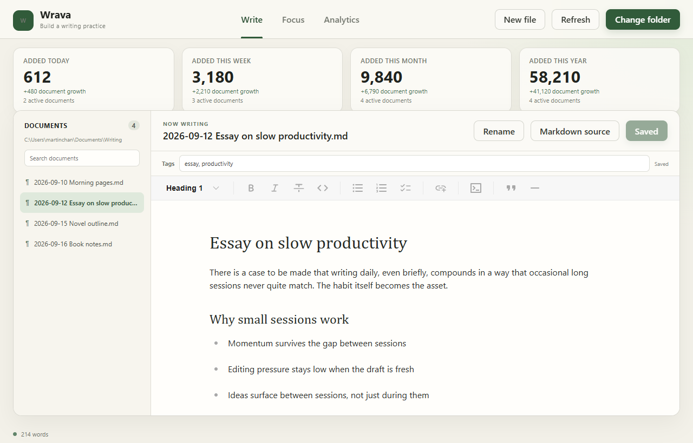
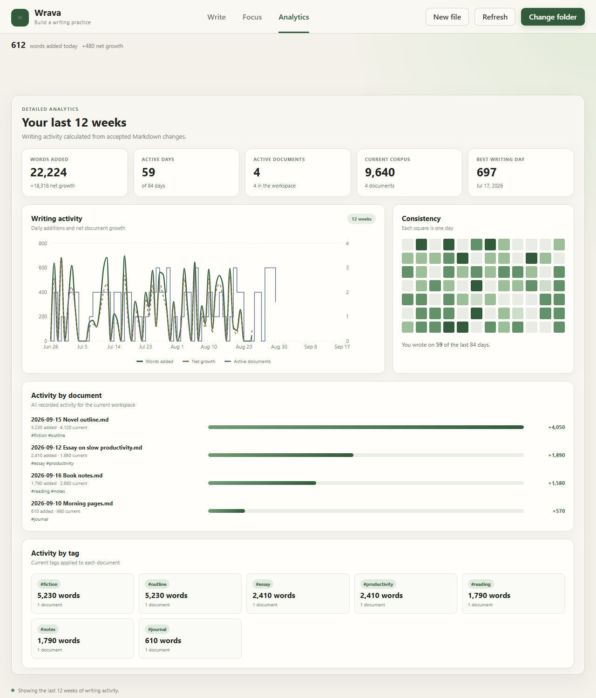
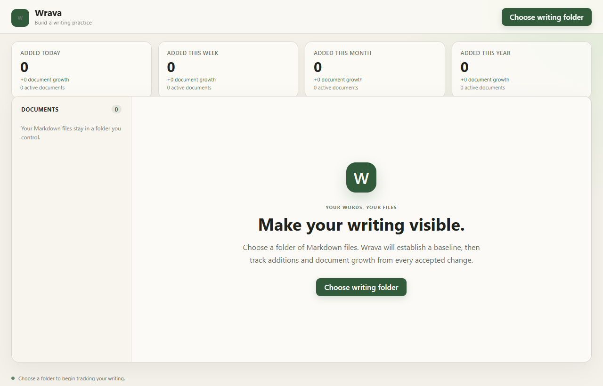

# Wrava

Wrava is a local-first desktop writing editor and activity tracker: a
lightweight "Strava for writing." Your writing stays in ordinary Markdown
files in a folder you control, while Wrava records additions and document
growth locally.

|                                          |                                          |
| ---------------------------------------- | ---------------------------------------- |
|  |  |



## Current vertical slice

- Select and index a folder of Markdown files.
- Create and safely rename Markdown files.
- Prefix newly created document titles and filenames with the local
  `yyyy-mm-dd` date.
- Write in a WYSIWYG-style rich editor while saving ordinary Markdown.
- Switch to a complete Markdown source editor when direct control is needed.
- Apply H1, H2, H3, bold, italic, underline, and link formatting.
- Add portable comma-separated tags stored in YAML front matter.
- Save files through the native application core.
- Reconcile changes made in other editors.
- Record words added, words deleted, and net document growth in SQLite.
- Show activity for today, this week, this month, and this year.
- Show the number of active documents alongside word activity.
- Explore a 12-week activity trend, consistency heatmap, and per-document
  and per-tag breakdowns on the detailed analytics page.

Existing files establish a zero-activity baseline when first indexed.

## Development

Prerequisites:

- Node.js
- Rust stable toolchain
- Windows prerequisites for Tauri 2

```powershell
npm install
npm run tauri dev
```

Run the frontend build with `npm run build` and Rust tests with:

```powershell
cargo test --manifest-path src-tauri\Cargo.toml
```

## Privacy

Wrava does not upload document contents or activity data. Markdown files remain
in the selected workspace. Derived activity data is stored in the operating
system's local application-data directory.

## License

MIT
