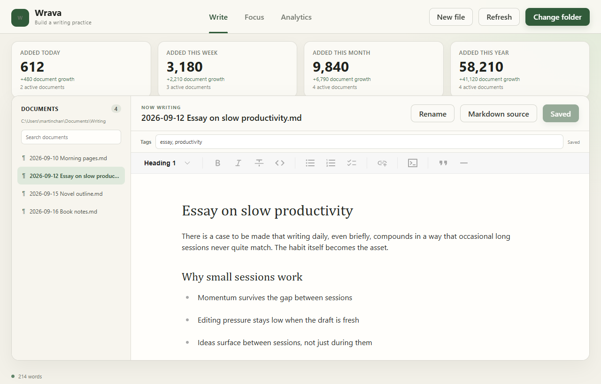
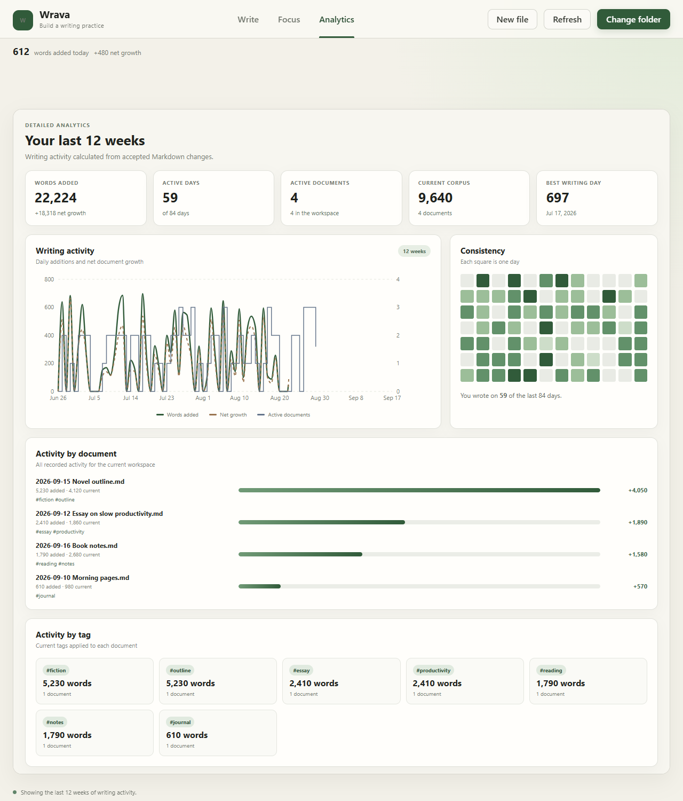
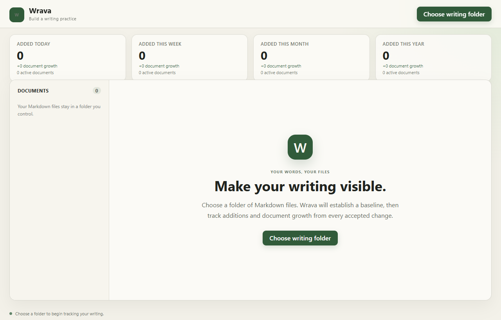

# Wrava

Wrava is a local-first desktop writing editor and activity tracker: a
lightweight "Strava for writing." Your writing stays in ordinary Markdown
files in a folder you control, while Wrava records additions and document
growth locally.

**[Try the live demo](https://martinctc.github.io/wrava/demo/)** in your
browser (no install, nothing is saved) · [Landing page](https://martinctc.github.io/wrava/)

|                                          |                                          |
| ---------------------------------------- | ---------------------------------------- |
|  |  |



## Current vertical slice

### Workspace
- **Select folder** — index a folder of Markdown files.
- **Title & filename** — independent H1 title (stored in file) and filename. Filename suggestions use `yyyy-mm-dd_title-slug.md` (max 80 chars by default). Existing files are never renamed.
- **Document order** — newest filename-date first by default; sidebar toggle reverses to oldest first. Undated files follow dated ones.
- **Tags** — portable comma-separated tags stored in YAML front matter.
- **Reconcile** — changes made in other editors are reconciled automatically.

### Editor
- **Rich editor** — WYSIWYG editing that writes ordinary Markdown.
- **Source editor** — full Markdown source control when needed.
- **Formatting** — H1, H2, H3, bold, italic, underline, and links.
- **Focus mode** — reclaim screen space via the icon beside editor controls; press Escape to exit. Analytics and Focus use a compact activity summary.

### Settings
- **Appearance** — instant Light/Dark switch; Settings panel remembers choices per device.
- **Autosave** — saves writing and tags after a 2-second pause (default on). Manual save and Ctrl+S work immediately. Failed saves show a retry error. (Demo saves only in memory; reload clears it.)
- **Editor size** — text-size slider from 12 to 28 px (16 px default) affects both editors only.
- **Spellcheck** — defaults to system settings; choose British English (`-ise`), US English, or Off. Bundled offline dictionaries exclude code, front matter, URLs, emails, and long non-prose tokens. Right-click or Alt+Enter for suggestions; corrections are opt-in and undoable.
- **Filename preferences** — control date prefix and max generated length (20–120 chars, 80 default) with a live example. Only future suggestions change.

### Analytics
- **Activity totals** — today, this week, this month, and this year; includes net document growth.
- **Goals** — optional daily/weekly/monthly/yearly net-word targets (0 disables). Progress bar shows pace needed, including average words per calendar day and daily catch-up rate for weekly goals. Negative totals stay visible; progress starts at zero.
- **Trend & consistency** — 12-week writing trend and 84-day heatmap.
- **Breakdowns** — per-document and per-tag activity (current word count, words added, net change).
- **Patterns** — common two-word phrase frequency (stopwords removed, no AI or judgment applied) from workspace content.

### Data
- **Baseline** — existing files establish a zero-activity baseline on first index.
- **Storage** — word additions/deletions and net growth recorded in SQLite; active document count shown alongside activity.

## Development

Prerequisites:

- Node.js 24 or later (for the built-in TypeScript test runner)
- Rust stable toolchain
- Windows prerequisites for Tauri 2

```powershell
npm install
npm run tauri dev
```

Run frontend helper tests with `npm test`, build with `npm run build`, and run
Rust tests with:

```powershell
cargo test --manifest-path src-tauri\Cargo.toml
```

The writing-controls browser regression runs with
`node tests\writingControls.browser.cjs` against a production preview on port
1421 (`npm run build`, then `npm run preview -- --port 1421`). It uses a
controllable desktop IPC stub for slow and failed saves. Set `WRAVA_PLAYWRIGHT`
to an installed `playwright-core` module and `WRAVA_BROWSER_PATH` to a Chromium
executable. These tools can live outside the project. `WRAVA_TEST_URL` overrides
the preview URL.

## Versioning and releases

Wrava follows [Semantic Versioning](https://semver.org/) and stays below
`1.0.0` while the core feature set is still settling. User-facing changes are
recorded in [NEWS.md](NEWS.md).

The version number must match across `package.json`,
`src-tauri/tauri.conf.json`, `src-tauri/Cargo.toml` and `src-tauri/Cargo.lock`.
`npm test` runs `scripts/check-version.mjs`, which fails if any of these
disagree, or if `NEWS.md` has no dated entry for the current version.

To cut a release:

1. Update the version in all four files above to the same value.
2. Move the `NEWS.md` `## Unreleased` items under a new
   `## <version> - <yyyy-mm-dd>` heading.
3. Run `npm test` to confirm the version and changelog are consistent.
4. Commit, merge to `master`, then tag the merge commit `v<version>` and push
   the tag. The `release` workflow builds and attaches the Windows MSI and
   NSIS installers automatically.

## Privacy

Wrava does not upload document contents or activity data. Markdown files remain
in the selected workspace. Derived activity data is stored in the operating
system's local application-data directory.

The bundled British and US spellcheck dictionaries run entirely on the device.
System-default spellchecking follows the host's spelling settings. Appearance,
spellcheck and filename preferences are saved locally. Dictionary and spelling
library licence notices are included in [public/licenses](public/licenses) and
in the built app.

## License

MIT
